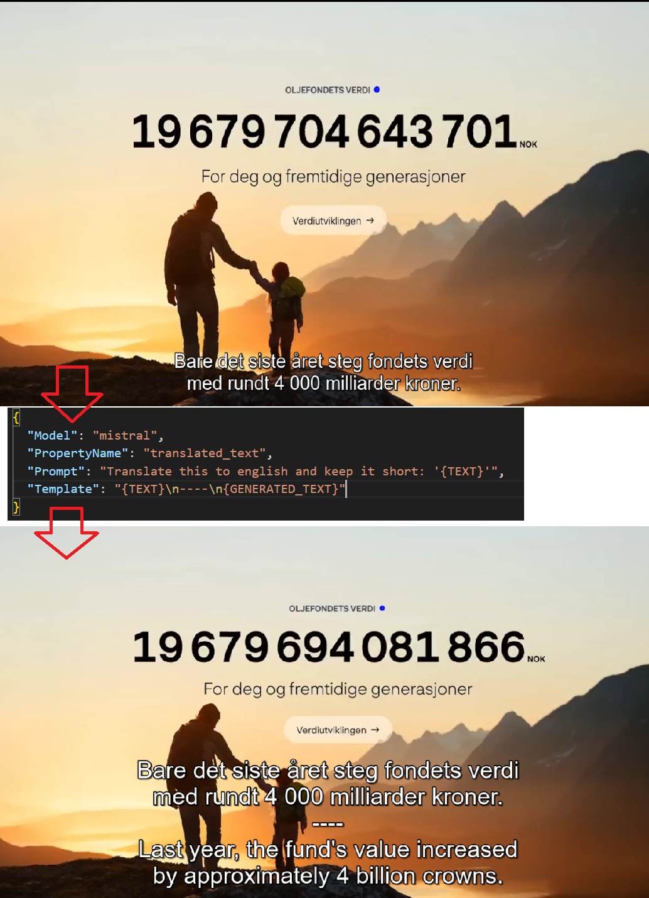

# GoSubAI
GoSubAI is a subtitle translator powered by AI and written in Go.

It lets you define custom prompts and behaviors to run an LLM model on subtitle files.

I created this project as a language-learning aid-being able to customize prompts helps me get the most out of the translations. For example, I can ask the AI for more literal translations, or display both the original and translated text side by side.

### Features:
- **Configurable Automation**: Define your own prompts to process subtitles.
- **Modularity**: Choose your preferred AI model.
- **SRT support**: Easily import & export subtitles to SRT format.

## Project Status

It was built over a few days but is designed to be modular and extendable, allowing for future enhancements and integrations.

You can easily set up and run this project entirely locally.

## Example Results

Below is an example of a before / after running GoSubAI with an example configuration:



## Prerequisites

Before using GoSubAI, ensure you have the following installed:

- **Golang**: Download and install Golang from [the official website](https://golang.org/dl/).
- **Ollama**: Download and install Ollama from [Ollama's website](https://ollama.com/).

To run Ollama in server mode, use the following command:

```sh
ollama serve
```

## Example Commands

### Generate subtitles

To produce subtitles, it's essential to specify a configuration that outlines the process to be executed on the subtitle files.
Additionally, provide a SubRip (SRT) file containing the subtitles.

Example:

```sh
cd GoSubAI
go run ./cmd/GoSubAI generate -config ./config/config_translate_to_eng.json -input ./data/HVOR_BLIR_DET_AV_PENGA.srt
```

### Run Unit Tests

To run unit tests, use the following command:

```sh
go clean -testcache; go test ./...
```

## Example configuration
```json
{
  "Model": "mistral",
  "PropertyName": "translated_text",
  "Prompt": "Translate this to english and keep it short: '{TEXT}'",
  "Template": "{TEXT}\n----\n{GENERATED_TEXT}"
}
```

